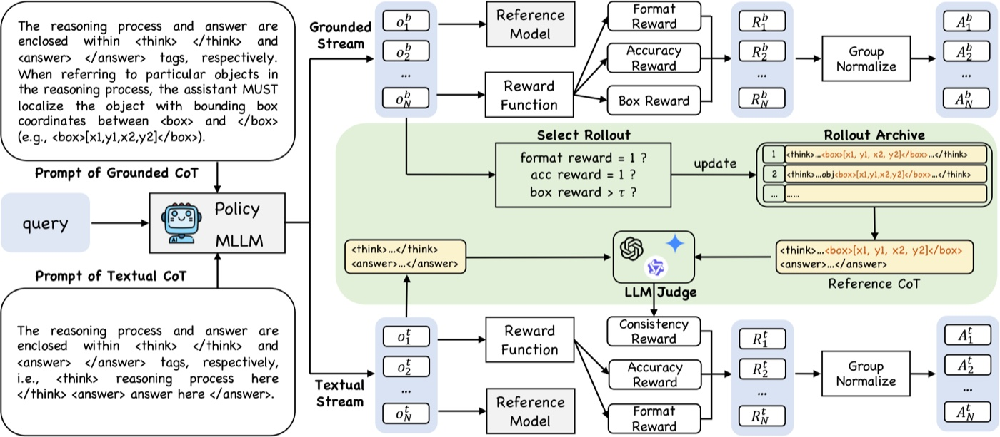
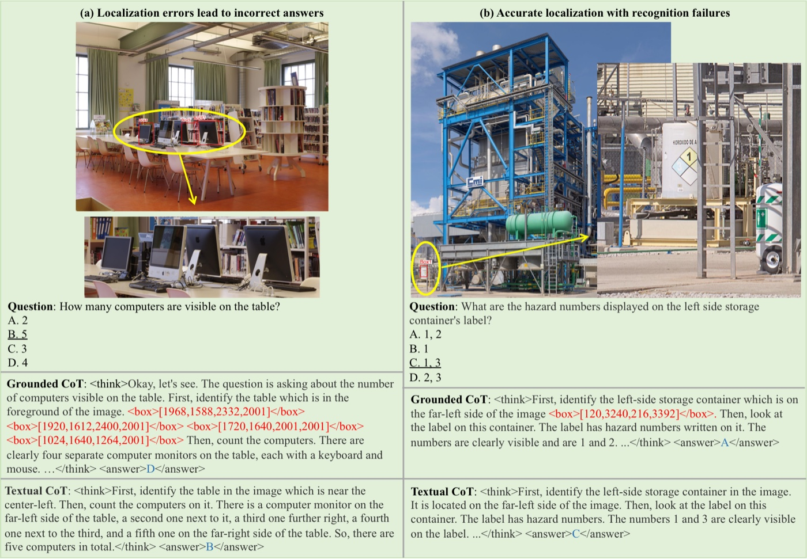

<div align="center">


[]() [](TODO_ARXIV) [](https://visual-ai.github.io/ivgr/) [](https://huggingface.co/collections/allencbzhang/ivgr)

</div>

### Method

<p align="center">
  
</p>


<details>
<summary><b>Qualitative Results</b></summary>

<p align="center">
  
</p>

</details>

<details>
<summary><b>Environment Setup</b></summary>

Our code is tested with **Python 3.11** and **CUDA 12.4**.

```bash
# 1. Create and activate a clean conda environment
conda create -n ivgr python=3.11 -y
conda activate ivgr

# 2. Install the core dependencies (Transformers + vLLM)
pip install transformers==4.52.4 vllm==0.8.5.post1

# 3. Install FlashAttention from the prebuilt wheel (cu12 / torch2.6 / cp311)
wget https://github.com/Dao-AILab/flash-attention/releases/download/v2.7.4.post1/flash_attn-2.7.4.post1+cu12torch2.6cxx11abiFALSE-cp311-cp311-linux_x86_64.whl
pip install flash_attn-2.7.4.post1+cu12torch2.6cxx11abiFALSE-cp311-cp311-linux_x86_64.whl

# 4. Install the remaining requirements
pip install -r requirements.txt

# 5. Install iVGR in editable mode (--no-deps keeps the versions pinned above)
pip install -e . --no-deps

# 6. Install the math verification utility
pip install math_verify
```

</details>

<details>
<summary><b>Data Preparation</b></summary>

We release the RL training data at [`allencbzhang/iVGR-RL-51K`](https://huggingface.co/datasets/allencbzhang/iVGR-RL-51K). The repo contains two files: `gvqa_and_mathdata.parquet` (the samples) and `images.tar.gz` (the corresponding images).

```bash
# 1. Download the dataset (parquet + image archive) from the Hugging Face Hub
huggingface-cli download allencbzhang/iVGR-RL-51K --repo-type dataset --local-dir ./data/iVGR-RL-51K

# 2. Extract the images into a folder
tar -xzf ./data/iVGR-RL-51K/images.tar.gz -C ./data/iVGR-RL-51K
```

After extraction, the directory should look like:

```
data/iVGR-RL-51K/               # ← data.image_dir
├── gvqa_and_mathdata.parquet   # training / validation samples
└── images/                     # extracted images (referenced by the parquet)
```

Then point the launch command in `examples/train_iVGR_qwen2_5_VL.sh` to these paths:

```bash
data.train_files=./data/iVGR-RL-51K/gvqa_and_mathdata.parquet \
data.val_files=./data/iVGR-RL-51K/gvqa_and_mathdata.parquet \
data.image_dir=./data/iVGR-RL-51K/ \
```

> **Note:** `data.image_dir` is prepended to the relative image paths stored in the parquet's `images` column (which already include the `images/` prefix), so it points to the dataset root `./data/iVGR-RL-51K/` rather than the `images/` subfolder.

</details>

<details>
<summary><b>Training</b></summary>

```bash
bash examples/train_iVGR_qwen2_5_VL.sh
```

</details>

<details>
<summary><b>Evaluation</b></summary>

```bash
# TODO: add evaluation commands
```

</details>

<details>
<summary><b>Acknowledgements</b></summary>

This project is built upon [EasyR1](https://github.com/hiyouga/EasyR1) (for training Qwen2.5-VL-7B) and [veRL](https://github.com/volcengine/verl) (for training Qwen3-VL-8B and 32B). We also sincerely thank the authors of [TreeVGR](https://github.com/Haochen-Wang409/TreeVGR) for their help in reproducing their work.

</details>

<details>
<summary><b>BibTeX</b></summary>

```bibtex
@inproceedings{zhang2026ivgr,
  title     = {iVGR: Internalizing Visually Grounded Reasoning for MLLMs with Reinforcement Learning},
  author    = {Zhang, Chang-Bin and Zhong, Yujie and Zhang, Qiang and Han, Kai},
  booktitle = {International Conference on Machine Learning (ICML)},
  year      = {2026}
}
```

</details>

